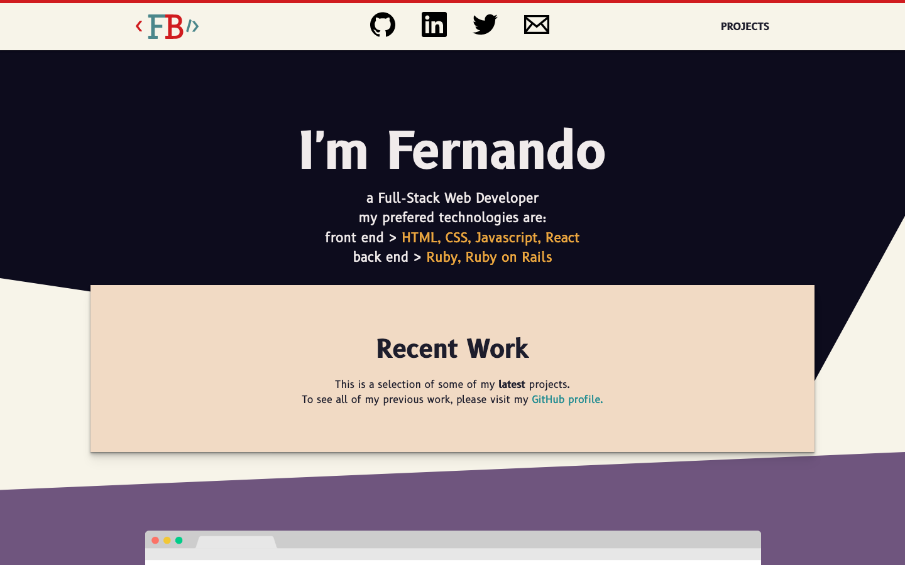
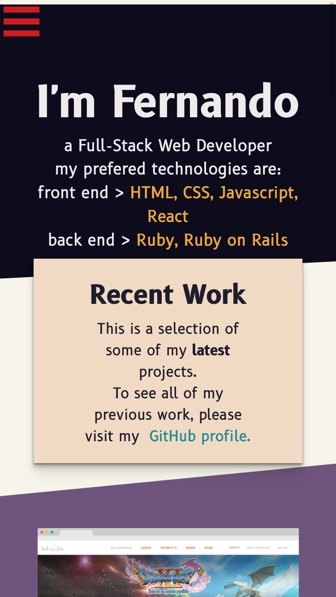

# Personal Portfolio
My Personal Portfolio. A responsive website constructed with HTML5, CSS and a tad of Javascript.

## Built With

- HTML
- CSS
- Javascript
- Responsive Design

## Screenshot

## Live Demo

https://fernando-bc.netlify.app/

## Authors

👤 **FERNANDO BAHAMONDES**

- Github: [@ferbaco86](https://github.com/ferbaco86)
- Twitter: [@ferbac0](https://twitter.com/ferbac0)
- Linkedin: [linkedin](https://www.linkedin.com/in/fernando-bahamondes-correa)

## 🤝 Contributing

Contributions, issues and feature requests are welcome!

Feel free to check the [issues page](issues/).

## Show your support

Give a ⭐️ if you like this project!

## Acknowledgments

- All pixel art created by me

## 📝 License

All rights reserved.
